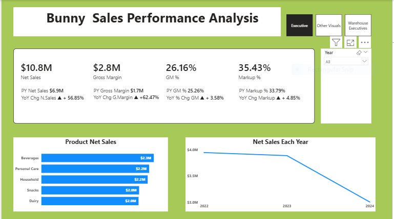
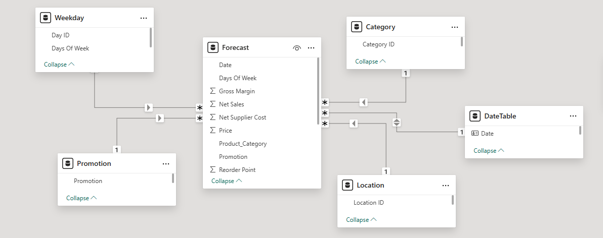

# Bunny-Sales-Performance-Analysis
## The analysis is strategically designed to support management decision-making by presenting clear, actionable KPI cards alongside relevant and insightful visuals that highlight performance trends and business opportunities.

## Executive Summary
- Management requires a comprehensive, data-driven analysis of the company’s end-to-end operations across all business units to enable informed decision-making, performance tracking, and strategic alignment.
- Management is keen to understand the level of patronage the business enjoys, especially on a daily basis with a particular focus on identifying a region that helps generate the highest net sales and see how the warehouse is supporting the business desire for sales through prompt distribution to different locations of the business.
- Therefore, I developed an interactive Power BI dashboard that consolidates all the critical KPIs and insightful visuals required to provide a clear, data-driven view of business performance.
## The Business Problem
Bunny requires a robust, data-driven solution to holistically evaluate business performance across the value chain—covering net sales, order received, and brand sales performance, while analyzing consumer response to brands over time.

### Key Questions Addressed:
- How have Key Performance Indicators (KPIs) changed YoY?
- Which product categories and regions are lagging?
- Days of the week the business makes more sales.
- Impact of warehouse in reducing lead time availability.
## The Process ( Methodology)
### Tool Used : 
Power BI, Power Query, DAX
### Data Sourcing & Overview
The dataset consists of approximately 1,000 transactions with 11 columns, covering operations across all current regions
### Data Cleaning & Transformation (ETL)
Using Power Query, the raw data was transformed to ensure accuracy:
- Removed duplicate entries from the dataset.
- Created a date table.
- Removed all the nulls.
- Created multiple Dimension tables.
- Extracted fact table.
- Developed a proper data model for ease of navigation and slicing.
- Extracted Names of the days of the week.
- Created a calculated column for Net Supplier Cost.
- Created a calculated column for Net Sales.
- Created a calculated column for Gross Margin.
  

## Analysis & Insights
This section breaks down the data into actionable stories.
## Analysis of  KPI cards
- The company’s net sales for the period under review amounted to $10.8M. Year-to-date (YTD), the business generated $3.9M, which is consistent with the amount recorded in the corresponding period of the previous year. Notwithstanding this equivalence in YTD performance, the Year-over-Year (YoY) analysis indicates a marginal decline of -1.46%.
- The business generated a gross margin of $2.8M for the period. In comparison, the preceding year recorded a gross margin of $1.7M, representing a Year-over-Year (YoY) increase of +62.47%. Furthermore, the gross margin in 2022 stood at $993,000, which is 0.44% lower than the gross margin reported in 2023, totaling $997,000.
- Bunny recorded a gross margin percentage of 26.16%, compared to 25.26% in the preceding period. This improvement reflects a Year-over-Year (YoY) increase of +3.58%.
- The markup for the period under review stood at 35.43%, compared to 33.79% recorded in the previous year. In 2022, the business recorded a markup of 33.64%, which increased by 2.60% in 2023 to reach 34.51%.
## Analysis Of Product Net Sales
Beverages recorded the highest overall sales at $2.3M, followed by Personal Care and Household, which generated $2.2M each. However, category performance varied significantly when assessed by individual years. In 2022, Personal Care delivered the lowest sales at $0.67M, with Snacks ranking second-lowest at $0.69M. By contrast, in 2023, Personal Care and Snacks emerged as the top-performing categories, generating $0.98M and $0.76M respectively.
## Analysis Of Net Sales For Years Under Review
The business experienced a decline in sales in 2024, generating $3.0M for the year. This contrasts with the stronger performance in 2023, when net sales reached approximately $3.9M. Additionally, 2022 recorded the highest sales within the three-year period, standing at $3.95M.
## Analysis Of Sales Volume  By Location And Amount
The influence of location on overall sales was minimal, as the analysis revealed only slight variations among the three locations in the dataset. The findings show that the majority of sales occurred in urban areas, with approximately 370K units sold, amounting to $3.9M (35.93%). Suburban areas followed with 336K units sold, totaling $3.5M (32.13%). Although rural areas recorded a higher unit count (343K) compared to the suburban segment, their total sales value was slightly lower at $3.5M (31.93%), indicating that suburban sales were marginally stronger in value despite fewer units sold.
Additionally, the data indicates that the business records its highest sales volumes on Thursdays, Mondays, and Sundays.
Recommendations
## Strengthen Sales in Lower-Performing Locations
Although location variance is minimal, suburban and rural areas show slightly lower value performance compared to urban regions.
- Implement targeted promotions or bundle offers tailored to suburban and rural customer preferences.
- Expand distribution partnerships in these areas to improve product availability and visibility.
## Optimize Product Mix by Category
Since Beverages, Personal Care, and Household are the major revenue drivers:
- Increase inventory allocation for these high-performing categories, especially during peak demand periods.
- Conduct deeper pricing and elasticity analysis for Personal Care and Snacks, which have recently become strong performers.
- Discontinue or revamp slow-moving SKUs to improve overall margin efficiency.
 ## Address the Sales Decline in 2024
The noticeable drop in 2024 sales signals a need for corrective action:
- Investigate external factors (competition, pricing changes, supply issues).
- Enhance customer retention through loyalty programs and targeted remarketing.
- Deploy seasonal campaigns to stimulate demand and recover lost momentum.
## Leverage High-Gross-Margin Opportunities
With increasing YoY margins and strong markups:
- Expand premium product lines where the business already enjoys healthy margins.
- Renegotiate supplier terms to further optimize markup and cost-to-margin ratios.
- Use Power BI margin segmentation to identify hidden margin gaps across SKUs.
## Maximize Sales on Peak Days
Since Thursdays, Mondays, and Sundays drive the highest transaction volumes:
- Launch promotional campaigns or price incentives strategically on these days.
- Increase stock availability and ensure operational readiness during these peak days.
- Introduce weekly sales patterns analysis to optimize workforce planning.
## Deploy Data-Driven Inventory Management
Given the unit sales distribution across locations:
- Apply demand forecasting models (e.g., exponential smoothing or ARIMA) to ensure accurate restocking.
- Use safety stock and reorder point calculations to reduce stockouts and excess inventory.
- Implement a Power BI dashboard that tracks real-time inventory against sales velocity.
## Enhance Customer Segmentation and Personalized Marketing
- Use demographic and behavioral data to design targeted campaigns for each product category.
- Leverage CRM tools to understand purchase frequency, basket size, and retention opportunities.

## Invest in Product Visibility and Merchandising
- Improve in-store product placement in locations with lower value sales.
- Strengthen brand presence through digital marketing, influencer partnerships, and community engagement initiatives. 

